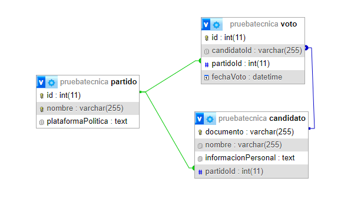

# Backend Prueba Tecnica

Este es el backend de una plataforma web para gestionar votos, candidatos y partidos.

## Tabla de Contenidos

- [Requisitos](#requisitos)
- [Instalación](#instalación)
- [Ejecución](#ejecución)
- [Tecnologías](#tecnologías)
- [Modelos](#modelos)
- [Base de Datos](#base-de-datos)

## Requisitos

Antes de comenzar, asegúrate de tener instalados los siguientes requisitos:

- Node.js
- npm (administrador de paquetes de Node.js)

## Instalación

1. Clona este repositorio en tu máquina local:

   ```bash
   git clone https://github.com/JaredPeralta/pruebaTecnica.git

2. Navega hasta el directorio del proyecto:

   ```bash
   cd pruebaTecnica\Backend

3. Instala las dependencias del proyecto:

   ```bash
   npm install

## Ejecución
Una vez que hayas clonado el repositorio y hayas instalado las dependencias, puedes ejecutar el backend de la siguiente manera:

    cd src
    node app.js

El backend estará disponible en http://localhost:5000

## Tecnologías
El backend de esta aplicación utiliza las siguientes tecnologías:

- Node.js: Plataforma de ejecución de JavaScript.
- Express: Framework de aplicaciones web para Node.js.
- Prisma: ORM (Object-Relational Mapping) para la base de datos, corriendo sobre SqLite como motor de base de datos

## Modelos
En este proyecto, hemos implementado los siguientes modelos:

- DAO (Data Access Object): Patrón que se encarga de la comunicación con la base de datos. Puedes encontrar los DAOs en la carpeta /dao.
- DTO (Data Transfer Object): Patrón que define la estructura de los objetos que se transmiten entre el frontend y el backend. Puedes encontrar los DTOs en la carpeta /dto.
- Singleton: Patrón que se utiliza para garantizar que haya una sola instancia de ciertos objetos en toda la aplicación, con esto nos aseguramos de tener solo una instancia de la base de datos en toda la aplicacion.

## Base de Datos
Modelo de la base de datos:



En la siguiente ruta se encuentran los archivos sql correspondientes a la construccion de la base de datos donde se pueden evidenciar las restricciones solicitadas en el enunciado.

```bash
   cd Backend\prisma\migrations
